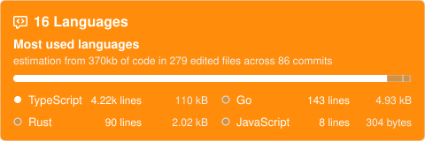

  <!-- 1. 상단 헤더 캡슐 -->
  
   
  
  <!-- 2. 프로필 SVG 카드 (원하시는 경우 유지 또는 생략 가능) -->
  
   
   

  <!-- 3. 커스텀 언어 카드 (languages-stat.svg) -->
  
   

  <!-- 4. 스네이크 애니메이션 -->
  
   

  <!-- 5. 하단 푸터 캡슐 -->
  

